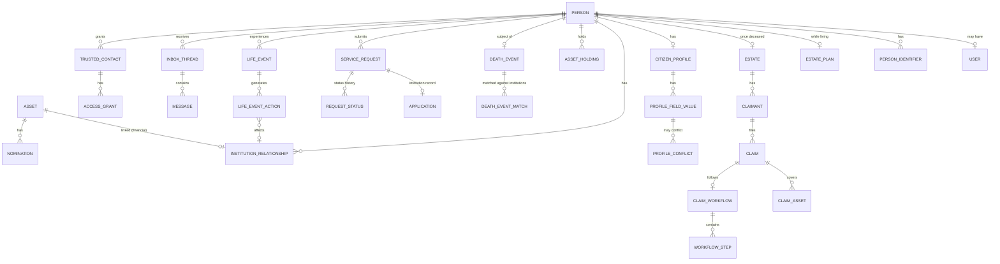

# Data Model

The full schema is `prisma/schema.prisma` (the source of truth — this document narrates it, it
does not replace reading it). It has two halves, added in two passes as the product thesis
broadened (see `CORRECTED_PRODUCT_THESIS.md`):

1. **Legacy & Succession domain** — the original estate/bereavement/claims design (~65 models).
2. **Lifelong Citizen Administration domain** — the broader master-profile, institutional graph,
   service-request, life-event, communication, and delegated-access layer (~35 models).

The two halves deliberately **share** `Person`, `Institution`, `LegalDocument`, `ConsentRecord`,
`Grievance`, `Payment`, and `AuditEvent` rather than duplicating them.

---

## Engineering choices that apply to every model

- **SQLite provider, no native `enum`.** SQLite's Prisma connector doesn't support enums, so every
  status/category/role field is a plain `String`, validated by Zod at the application boundary
  (see `src/lib/validation` — Zod schemas mirror the string unions documented in each model's
  comment in `schema.prisma`). This keeps the schema unchanged if it's ever pointed at Postgres.
- **No native `Json` columns.** Structured, variable-shape data (rule definitions, permission
  scopes, match factors) is stored as a JSON-serialized `String`, read/written through
  `src/lib/json.ts`'s `toJsonColumn`/`fromJsonColumn` helpers — again for cross-engine portability.
- **Masked identifiers only.** `PersonIdentifier` never stores a raw Aadhaar/PAN/passport number —
  only a masked display value and a salted `valueHash` used purely for equality matching.
- **Provenance and verification on nearly everything.** Fields like `provenance`, `verified`,
  `verificationStatus`, and `confidence`/`matchConfidence` appear throughout so the UI can always
  show "is this self-reported or verified, and by what source."
- **Append-only by convention, not by database constraint.** `AuditEvent`, `RequestStatus`,
  `SourceSync`, and `Decision` rows are only ever inserted, never updated, from application code.
  SQLite itself can't enforce true immutability — see `docs/SECURITY.md` for what a production
  tamper-evident log would add (hash-chaining or a write-once store).

---

## Legacy & Succession domain — model groups

| Group | Models |
|---|---|
| Identity & people | `User`, `Person`, `PersonIdentifier`, `ContactMethod`, `Address`, `Relationship`, `Household`, `HouseholdMember` |
| Estate planning (living) & Estate (post-death) | `EstatePlan`, `ReviewReminder`, `Estate`, `IdentityRecord` |
| Death-event lifecycle | `DeathEvent`, `DeathEventEvidence`, `DeathEventMatch`, `DeathEventCorrection` |
| Trusted Contacts, consent & access | `TrustedContact`, `AccessPolicy`, `AccessGrant`, `ConsentRecord`, `ConsentArtefact` |
| Institutions & integrations | `Regulator`, `Institution`, `Connector`, `Integration`, `ExternalRecordReference` |
| Assets & liabilities | `Asset`, `AssetHolding`, `Liability`, `Nomination`, `BeneficiaryDesignation`, `JointHolder` |
| Wills, trusts & authority | `WillRecord`, `TrustRecord`, `ExecutorAppointment`, `AuthorityCredential`, `LegalDocument`, `DocumentVerification` |
| Claims | `Claimant`, `Claim`, `ClaimAsset`, `ClaimWorkflow`, `WorkflowStep`, `Requirement`, `SubmittedEvidence`, `CaseAssignment`, `Decision`, `DeficiencyRequest`, `Dispute`, `CourtOrder` |
| Settlement | `Payment`, `Transfer`, `Mutation`, `RecordUpdate` |
| Notifications, fraud, audit, rules | `Notification`, `Communication`, `Grievance`, `FraudSignal`, `AuditEvent`, `SLA`, `Jurisdiction`, `Rule`, `RuleVersion` |

The `DeathEvent.status` lifecycle is the single most important state machine in this half:
`reported → evidence_submitted → registrar_verified → identity_match_pending → matched →
partially_matched → contested → corrected → cancelled → finalised`. See the `stateDiagram-v2` in
`docs/WORKFLOWS.md`.

## Lifelong Citizen Administration domain — model groups (by product domain)

| Domain | Models |
|---|---|
| A. Master Profile | `CitizenProfile`, `ProfileField`, `ProfileFieldValue`, `ProfileConflict` |
| B. Institutional Relationship Graph | `InstitutionRelationship`, `SourceSync` |
| C. Document & Evidence Hub | `DocumentProfile`, `DocumentShare`, `Renewal`, `Signature` (extend `LegalDocument`) |
| D. Service Request Engine | `ServiceCatalogue`, `ServiceDefinition`, `ServiceChannel`, `EligibilityRule`, `RequiredField`, `RequiredDocumentRule`, `InstitutionStatusMapping`, `ServiceRequest`, `Application`, `RequestStatus`, `Submission`, `Appointment`, `InPersonTask`, `ServiceFee` |
| F. Life-Event Orchestration | `LifeEventTemplate`, `LifeEvent`, `LifeEventAction`, `Deadline` |
| E. Communication & Inbox | `InboxThread`, `Message`, `Notice` |
| H. Delegated Access & Consent | `ConsentPurpose`, `ConsentScope`, `DataShare`, `ProfessionalRepresentative`, `DelegatedTask`, `Escalation`, `Appeal` |

---

## Where this prototype consolidates spec-named entities

The original design brief named a few entities that this schema deliberately merges into an
existing model, to avoid duplicate near-identical tables. Each merge is a real engineering
decision, not an oversight:

| Spec-named entity | Consolidated into | Why |
|---|---|---|
| `InstitutionalAccount` | `InstitutionRelationship` (+ linked `Asset` for financial holdings) | One row already carries reference number, status, renewal date, nominee summary, sync state — a second table would just be a foreign key away with no new information. |
| `RecordDiscrepancy` | `ProfileConflict` | Identical concept — a detected disagreement between two field values. |
| `IntegrationCapability` | `Connector.integrationLabel` | The six-value label (real/partner/institution-specific/manual/prototype/policy-dependency) already *is* the capability classification. |
| `DataAccessEvent` | `AuditEvent` (tagged by `entityType`/`action`) | A second audit table would fragment the one place auditors look. |
| `SyncFailure` | `SourceSync.status = 'partial_failure' \| 'failed'` + `failureReason` | A failure is a terminal state of a sync run, not a separate lifecycle. |
| `Verification` (generic) | `DocumentVerification` + `IdentityRecord` (already existed) | Two purpose-built verification records cover documents and identity claims; a third generic one would only add ambiguity about which to use. |
| `Application` vs `ServiceRequest` | Kept as two models, linked 1:1 | `ServiceRequest` is the citizen-facing normalized object; `Application` is deliberately the institution-side record (its own application number and raw status text) — collapsing them would lose the "always show the institution's own status" principle. |

## Entity-relationship diagram (core relationships)

See `prisma/schema.prisma` for every field, and `docs/ARCHITECTURE.md` for how the app layer reads
and writes this schema (Server Components query directly; Server Actions mutate; the connector
layer is the only place that simulates an external system).
