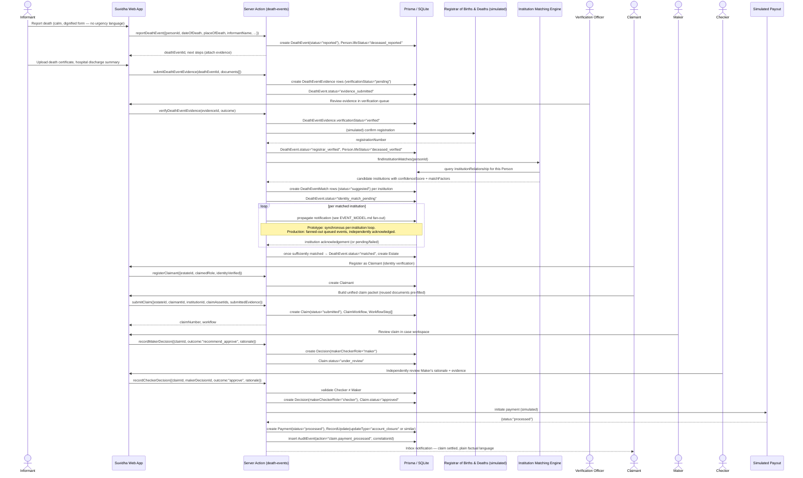
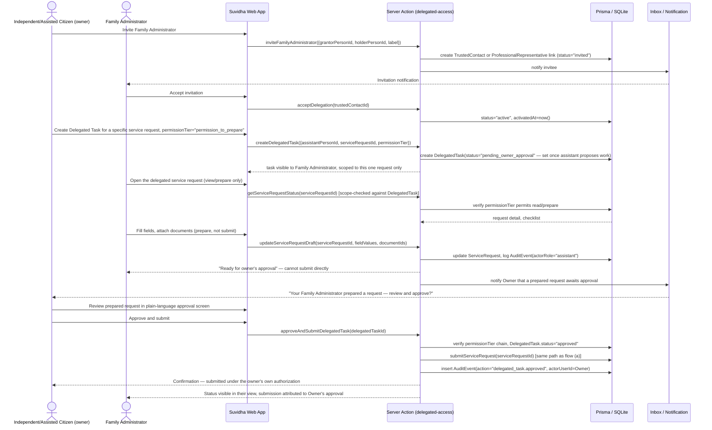

# Sequence Diagrams

These diagrams describe end-to-end flows across the citizen UI, Suvidha's Server Actions, the
simulated connector/registry layer, and the institution console. They depict the **target
behavior** the golden demo flows are designed around (see `docs/TEST_PLAN.md` for which flows have
full end-to-end test coverage today). Per `docs/EVENT_MODEL.md`, connector calls shown here as
message arrows are synchronous function calls in the current prototype, not real network hops or
queued events — the diagrams are drawn at the level a production build would actually behave at,
with the prototype's simplification noted inline where it matters.

---

## (a) Citizen-initiated address-change service request, end to end

Covers: Domain F (Life-Event Orchestration) triggering Domain D (Unified Service Request Engine)
actions, a simulated bank connector call, normalized-vs-raw status handling, and Domain E (Inbox)
notification on completion.

```mermaid
sequenceDiagram
    actor Citizen as Independent Citizen
    participant UI as Suvidha Web App
    participant SA as Server Action (life-event / requests)
    participant DB as Prisma / SQLite
    participant Conn as Simulated Bank Connector
    participant Inbox as Inbox / Notification

    Citizen->>UI: Start "Address Change" life event
    UI->>SA: startLifeEvent(personId, "address_change")
    SA->>DB: create LifeEvent + generate LifeEventAction plan
    DB-->>SA: LifeEvent, LifeEventAction[] (mandatory/recommended/optional, sequenced)
    SA-->>UI: plan with per-action executionMethod labels
    UI-->>Citizen: Show ordered checklist (e.g. Aadhaar first, then bank)

    Citizen->>UI: Select "HDFC Bank Savings" action → create service request
    UI->>SA: createServiceRequest({serviceDefinitionId, institutionRelationshipId, lifeEventId})
    SA->>DB: insert ServiceRequest (normalizedStatus="draft"), compute missing requirements
    DB-->>SA: ServiceRequest, missingRequirements[]
    SA-->>UI: draft request + checklist (documents/fields still needed)

    Citizen->>UI: Fill required fields, attach reused address-proof document
    UI->>SA: reuseDocument(serviceRequestId, legalDocumentId)
    SA->>DB: attach LegalDocument, verify institution reuse policy
    DB-->>SA: requirementSatisfied = true
    SA-->>UI: ready_to_submit

    Citizen->>UI: Confirm and submit
    UI->>SA: submitServiceRequest(serviceRequestId)
    SA->>DB: insert Submission, set normalizedStatus="submitted"
    SA->>Conn: sync(institutionRelationshipId, correlationId)
    Note over Conn: Prototype: synchronous canned response.<br/>Production: queued call with retry/backoff (see EVENT_MODEL.md)
    Conn-->>SA: {status:"success", officialStatusRaw:"Request Received - Under Verification"}
    SA->>DB: insert RequestStatus(normalizedStatus="acknowledged", officialStatusRaw=...)
    SA->>DB: insert AuditEvent(action="service_request.status_changed", correlationId)
    SA-->>UI: updated status (normalized + raw shown side by side)

    Conn->>SA: (later) webhook: status update → "Address Updated"
    SA->>DB: insert RequestStatus(normalizedStatus="completed"), update LifeEventAction.status
    SA->>Inbox: create InboxThread/Message ("Your address change is complete")
    Inbox-->>Citizen: Notification in unified inbox
    UI-->>Citizen: Life event progress bar updates; next action surfaced
```

---

## (b) Death-event report → verification → institution matching → claim → maker-checker → payout

Covers: Domain I end to end — from `Person.lifeStatus` transition through `DeathEvent`,
`DeathEventMatch`, `Claim`, `Decision` (maker/checker), to `Payment`.



---

## (c) Family-administrator delegated task: invite → grant scope → assistant prepares → owner approves → submission

Covers: Domain H (Delegated Access & Consent) working together with Domain D (Service Request
Engine), showing the permission-tier boundary between "prepare" and "submit."



---

## (d) False-death correction: challenge → re-verification → registrar correction → agency acknowledgements → restoration

Covers: `DeathEventCorrection` lifecycle (Scenario 5 in the schema comments) — the safety-critical
reversal path.

```mermaid
sequenceDiagram
    actor LegalRep as Legal Representative (the wrongly-flagged living person's representative)
    participant UI as Suvidha Web App
    participant SA as Server Action (death-event corrections)
    participant DB as Prisma / SQLite
    participant Registrar as Registrar of Births & Deaths (simulated)
    actor VerifOfficer as Verification Officer
    participant Institutions as Matched Institutions (simulated, fan-out)
    participant Inbox as Inbox / Notification

    LegalRep->>UI: Challenge a death-event match ("this person is alive")
    UI->>SA: challengeDeathEventMatch({deathEventId, reason})
    SA->>DB: create DeathEventCorrection(status="challenge_initiated")
    SA->>DB: DeathEvent.status="contested"
    Note over SA,DB: No institution debit-freeze or other risk action is escalated<br/>further while contested; existing ones remain flagged for review.

    SA->>Inbox: notify Verification Officer of contested case
    Inbox-->>VerifOfficer: New contested death-event review

    VerifOfficer->>UI: Request additional identity evidence from the living person
    LegalRep->>UI: Submit fresh identity verification (e.g. in-person / video KYC simulated)
    UI->>SA: submitIdentityRecord({personId, method, outcome})
    SA->>DB: create IdentityRecord(outcome="verified")
    SA->>DB: DeathEventCorrection.status="reverification_in_progress"

    VerifOfficer->>UI: Confirm misidentification / clerical error
    UI->>SA: confirmCorrection({deathEventCorrectionId, resolutionNotes})
    SA->>Registrar: (simulated) request registration correction
    Registrar-->>SA: correction confirmed
    SA->>DB: DeathEventCorrection.status="registrar_corrected"
    SA->>DB: DeathEvent.status="corrected", Person.lifeStatus="deceased_disputed" → "living"

    loop per institution with a DeathEventMatch on this DeathEvent
        SA->>Institutions: notify reactivation required (correlationId carried through)
        Institutions-->>SA: acknowledgement + confirmation any risk action was reversed
        SA->>DB: update DeathEventMatch.status, riskActionApplied="no_action_required" or reversed
        Note over SA,Institutions: Prototype: synchronous per-institution loop.<br/>Production: fanned-out queued events,<br/>independently retried until every institution acknowledges (EVENT_MODEL.md).
    end

    SA->>DB: DeathEventCorrection.status="agencies_notified"
    alt all institutions acknowledged
        SA->>DB: DeathEventCorrection.status="resolved", resolvedAt=now()
        SA->>Inbox: notify Legal Representative — restoration complete, factual tone
    else some institutions still pending or failed
        SA->>DB: leave status="agencies_notified"; surface pending list for manual follow-up
        SA->>Inbox: notify Verification Officer — manual fallback needed for pending institutions
    end
    SA->>DB: insert AuditEvent(action="death_event.correction_resolved" or interim state, correlationId)
```
