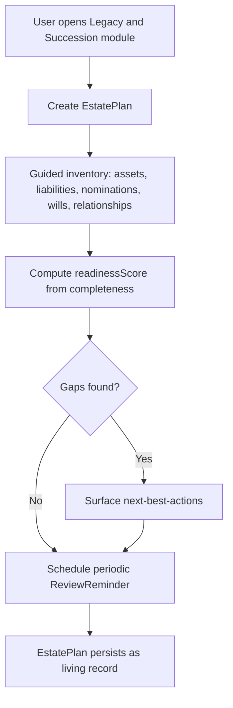
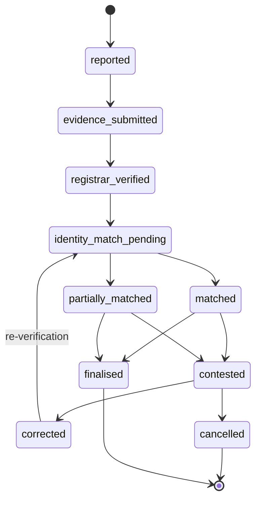
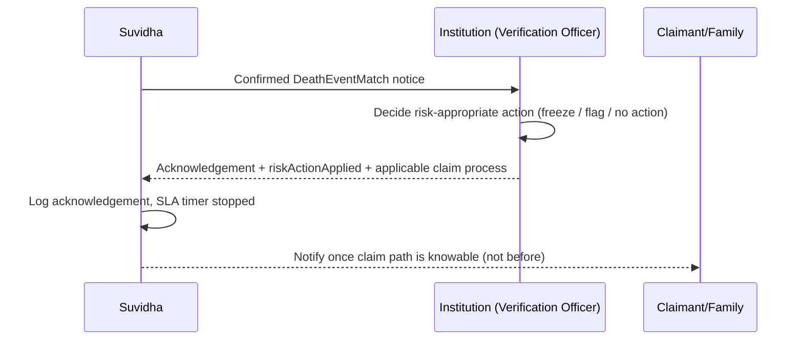
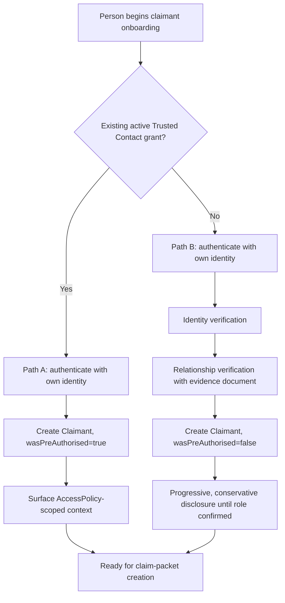
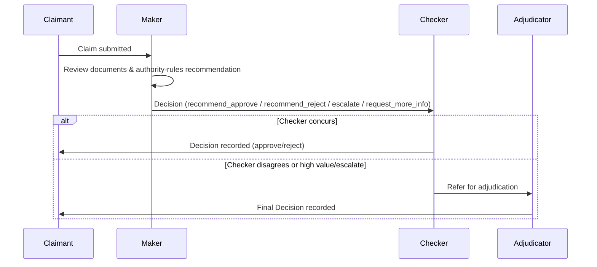
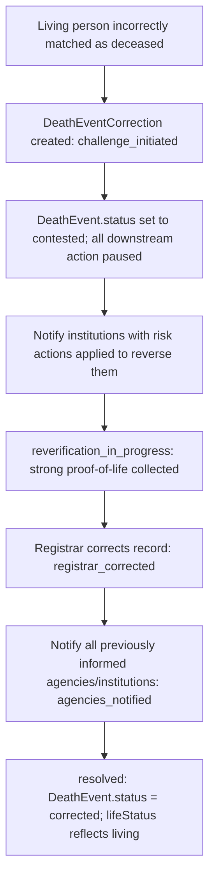

# Workflows — Legacy, Incapacity, Bereavement & Succession

This document specifies every named workflow in the Legacy & Succession domain: trigger, actor,
preconditions, steps, data/documents required, consent/authority basis, institution decision point,
notifications, failure conditions, exception paths, audit events, and completion criteria. Related
asset-specific settlement workflows (Section 8) share a common claim-processing skeleton
(Section 6.4) and are documented as deltas against it to avoid repetition, while still giving each
its own decision, documents, and notifications.

Throughout: a claimant authenticates with **their own** verified identity — never through the
deceased person's credentials. Deceased status is never publicly exposed
(`DeathEvent.isPubliclyVisible` must always stay `false`). Every step that changes state records an
`AuditEvent`.

---

## 1. Living-person setup workflows

### 1.1 Living user onboarding into the Legacy & Succession module

- **Trigger:** An existing Suvidha `User` (already onboarded to the lifelong-administration
  platform via `CitizenProfile`) opens the Legacy & Succession module for the first time, or a new
  user signs up directly into it.
- **Actor:** Estate Planner (living person).
- **Preconditions:** `User` has a verified `Person` record and at least one verified contact method
  (`ContactMethod.verified = true`).
- **Steps:**
  1. Create `EstatePlan` (`readinessScore = 0`).
  2. Prompt the user through a guided inventory: assets (`Asset`, `AssetHolding`), liabilities
     (`Liability`), existing nominations (`Nomination`), wills/trusts referenced (`WillRecord`,
     `TrustRecord`), key relationships (`Relationship`), and an optional plain-language
     `emergencyInstructions` note for family.
  3. Compute `readinessScore` from completeness of the above (has-a-will, has-nominations-on-key
     assets, has-a-trusted-contact, has-relationship-data) — **never from balances or asset
     value**, so the score cannot be read as a wealth signal by anyone who sees it.
  4. Surface next-best-actions: add a nomination, invite a Trusted Contact, record a will.
  5. Schedule a `ReviewReminder` (e.g. annual review, or triggered by a life event such as
     marriage/childbirth from the lifelong-administration `LifeEvent` engine).
- **Data required:** identity, at minimum one asset or liability to make the plan non-empty,
  relationship data if nominations/guardianship are to be modelled.
- **Documents required:** none mandatory at this stage; document upload is optional and deferred to
  specific sub-flows (will recording, nomination update).
- **Consent/authority basis:** the user acting on their own record; no third-party consent needed.
- **Institution decision:** none — this is a Suvidha-only planning artifact until an asset is
  actually linked to a real institution relationship.
- **Notifications:** in-app confirmation; `ReviewReminder` notifications on schedule.
- **Failure conditions:** none blocking — an incomplete plan is a valid, common state; the UI must
  never guilt or alarm the user about a low score (no countdowns, no red urgency banners).
- **Exception paths:** user abandons mid-flow — plan persists at whatever completeness was reached.
- **Audit events:** `estate_plan.created`, `estate_plan.updated`.
- **Completion criteria:** an `EstatePlan` exists; there is no terminal "done" state — this is an
  ongoing living record, consistent with `readinessScore` being a completeness gauge, not a
  one-time task.



### 1.2 Nomination-gap identification

- **Trigger:** Scheduled scan (on plan update, on new asset linkage, or on periodic review) across
  a Person's `Asset` holdings.
- **Actor:** System, surfaced to the Estate Planner.
- **Preconditions:** at least one `Asset` linked to the person via `AssetHolding`.
- **Steps:**
  1. For each `Asset`, check for an active `Nomination` (`status = "active"`) or, where relevant,
     applicable joint-holding survivorship (`JointHolder`).
  2. Flag assets with: no nomination at all; a nomination marked `outdated` (e.g. predates a
     reported life event such as marriage/divorce/childbirth); a nomination whose named person does
     not resolve to a known `Person` and cannot be corroborated (`nomineePersonId = null`); a
     nomination pointing at a minor without guardian details (`isMinor = true`,
     `guardianNameOnRecord = null`).
  3. Present each gap with a plain-language explanation of consequence (e.g. "no nominee on file
     means your institution will require legal-heir documentation from your family — you can avoid
     that by adding a nominee now") and a deep-link/assisted path to update it at the institution
     (per that institution's `ExecutionMethod`).
- **Data required:** none beyond existing `Asset`/`Nomination` rows.
- **Documents required:** none for identification; updating a nomination follows the institution's
  own process (outside Suvidha's direct control in most cases — `deep_link_redirect` or
  `in_person_required`).
- **Consent/authority basis:** the user's own data; no third-party consent.
- **Institution decision:** not applicable to the gap scan itself; the institution decides on any
  actual nomination-update request the user initiates from here.
- **Notifications:** in-app list of gaps; optional periodic reminder, capped in frequency and never
  phrased as alarming or urgent.
- **Failure conditions:** none — this is informational.
- **Exception paths:** none.
- **Audit events:** `nomination_gap.identified` (informational, low-sensitivity).
- **Completion criteria:** all discoverable assets have either an active, resolvable nomination or
  an explicit "reviewed, no nomination applicable" acknowledgement from the user (e.g. sole
  proprietorship asset where nomination doesn't apply).

### 1.3 Trusted Contact invitation, permission grant, and revocation

- **Trigger:** Estate Planner chooses to name a Trusted Contact.
- **Actor:** Estate Planner (grantor); invited person (holder).
- **Preconditions:** grantor has a verified `Person` record; invitee identified by contact method.
- **Steps (invitation):**
  1. Grantor creates `TrustedContact` (`status = "invited"`), selecting or creating the holder
     `Person`, and an `AccessPolicy` (e.g. "Emergency contact only", "Full inventory, no
     balances") — never a policy that implies ownership or executorship.
  2. Grantor optionally scopes it further via `AccessGrant.scopeConfig` (specific asset categories
     or documents) and `purposeTags`.
  3. Invitation sent to holder (`Notification`, channel per holder's contact method).
  4. Holder accepts → `TrustedContact.status = "active"`, `activatedAt` set. Holder declines or
     ignores → remains `invited` indefinitely, or is expired per institution-configured policy.
- **Steps (permission grant / adjustment):** Grantor may add further `AccessGrant` rows under
  additional `AccessPolicy` templates at any time, or revise `scopeConfig`.
- **Steps (revocation):** Grantor revokes at any time — `TrustedContact.status = "revoked"`,
  `revokedAt` set; all associated `AccessGrant` rows set to `status = "revoked"`,
  `revokedAt` set. Revocation is immediate and does not require the holder's acknowledgement.
- **Data required:** holder's identity/contact details; policy selection.
- **Documents required:** none.
- **Consent/authority basis:** this *is* the consent instrument — the grantor's own
  `TrustedContact`/`AccessGrant` records. A Trusted Contact grant is **never** nomination,
  executorship, or ownership, and never allows the holder to log in as the grantor or access funds
  directly (see `docs/TERMINOLOGY.md` §5, prohibited terms).
- **Institution decision:** not applicable — this is a Suvidha-side visibility/access construct,
  not an instruction to any institution (though the `emergencyInstructions` field on `EstatePlan`
  may reference institution-specific guidance the grantor has manually assembled).
- **Notifications:** invitation, activation, and revocation each notify both parties.
- **Failure conditions:** holder never accepts — invitation stays pending, no access is granted.
- **Exception paths:** grantor revokes mid-review (e.g. after a falling-out) — immediate effect;
  holder's prior access to already-viewed data is not retroactively un-seen, but no further access
  occurs, and the event is logged for accountability (`AccessGrant.revokedAt`).
- **Audit events:** `trusted_contact.invited`, `trusted_contact.activated`,
  `trusted_contact.revoked`, `access_grant.granted`, `access_grant.revoked`.
- **Completion criteria:** `TrustedContact.status` reflects the current true state at all times;
  no stale "active" access survives a revocation.

```mermaid
sequenceDiagram
    participant G as Grantor (Estate Planner)
    participant S as Suvidha
    participant H as Holder (Trusted Contact)

    G->>S: Create TrustedContact (status=invited) + select AccessPolicy
    S->>H: Notification: invitation
    alt Holder accepts
        H->>S: Accept
        S->>S: status=active, activatedAt set
        S->>G: Notification: activated
    else Holder ignores/declines
        S->>S: status remains invited
    end
    G->>S: (later) Revoke TrustedContact
    S->>S: status=revoked, revokedAt set; all AccessGrants revoked
    S->>H: Notification: access revoked
```

### 1.4 Will and executor recording

- **Trigger:** Estate Planner has executed (or wishes to reference) a will, or wishes to set up a
  trust.
- **Actor:** Estate Planner (Testator/Settlor).
- **Preconditions:** verified `Person` record.
- **Steps:**
  1. Create `WillRecord` with `storageStatus` = `referenced_only` (just noting a will exists and
     where the original is kept), `uploaded` (a scanned copy held by Suvidha as a `LegalDocument`),
     or `registered_with_sub_registrar`.
  2. Record `registrationStatus` (`unregistered`/`registered`), `executionDate`, and version
     metadata (`version`, `isLatestKnownVersion` — set the prior version's flag `false` when a new
     will supersedes it).
  3. Add `ExecutorAppointment` row(s) — primary and, optionally, alternate executors — resolving to
     a known `Person` where possible (`executorPersonId`) or recording `executorNameOnRecord` where
     not.
  4. Add `BeneficiaryDesignation` rows linked to the will for named beneficiaries and shares.
  5. Optionally create `TrustRecord` similarly, with its own `BeneficiaryDesignation` rows.
- **Data required:** testator identity, executor identity/contact, beneficiary identities and
  shares, execution date.
- **Documents required:** the will document itself (`LegalDocument`, `documentType = "will"`) if
  `storageStatus != referenced_only`; Suvidha stores it as an uploaded reference — it does not
  draft, notarise, or register the will.
- **Consent/authority basis:** the testator's own act; no third-party consent required to record
  it, though naming a person as executor should trigger a courtesy notification to that person
  (not a legal appointment — the will itself is the legal instrument; Suvidha only mirrors it).
- **Institution decision:** not applicable pre-death; this is a planning record. Financial
  institutions are not notified at this stage.
- **Notifications:** confirmation to testator; optional courtesy notice to named executor(s).
- **Failure conditions:** none blocking.
- **Exception paths:** superseding will recorded — prior `WillRecord.isLatestKnownVersion` set to
  `false`, never deleted, so a later dispute over which will governs has full history.
- **Audit events:** `will_record.created`, `will_record.updated`, `executor_appointment.created`.
- **Completion criteria:** a `WillRecord` exists with at least one `ExecutorAppointment` if the
  planner wants executor-led administration flagged as their intended pathway; the record remains
  advisory until death — Suvidha never treats a recorded will as *legally* proven until a
  post-death `AuthorityCredential`/probate step, where applicable, validates it.

---

## 2. Death reporting workflows

### 2.1 Hospital/registrar death notification

- **Trigger:** A hospital or the Registrar of Births and Deaths records a death through an
  integrated or manually-relayed channel.
- **Actor:** Registrar of Births and Deaths / Issuing Authority (institution-side); Suvidha as
  recipient.
- **Preconditions:** the deceased has a resolvable `Person` record (via identifiers) or a new one
  is created.
- **Steps:**
  1. Registrar channel submits (or Suvidha operator manually records, in the prototype's simulated
     integration) date of death, place of death, and a registration reference.
  2. `DeathEvent` created: `status = "reported"`, `dateOfDeath`, `placeOfDeath`,
     `registrarJurisdictionId` set, `reportedByPersonId` left null (registrar-originated, not a
     family informant) or set if the registrar recorded an informant.
  3. Evidence: a `DeathEventEvidence` row created with `evidenceType = "death_certificate"` (or
     interim evidence pending final certificate) and `verificationStatus` progressing from
     `pending` → `verified`.
  4. On registrar confirmation of the record (simulated CRS check), `DeathEvent.status` advances to
     `"registrar_verified"`.
  5. `Person.lifeStatus` is **not** flipped to a deceased state yet — that only happens once
     matching (Section 2.3) resolves per-institution, since `lifeStatus` here reflects Suvidha's
     own resolved understanding of the record, gated on identity-match confidence, not merely on a
     registrar feed being received.
- **Data required:** date/place of death, registration number, jurisdiction.
- **Documents required:** death certificate (or equivalent interim registrar evidence).
- **Consent/authority basis:** registrar authority is a public function, not a citizen consent
  grant; Suvidha receives it under its role as Record Custodian / integration recipient, subject to
  purpose limitation (used only for death-event resolution, never republished).
- **Institution decision:** not applicable to the registrar step itself (see Section 2.4 for what
  institutions then decide).
- **Notifications:** none externally at this point — `isPubliclyVisible` stays `false`; no premature
  notice reaches any institution until matching (Section 2.3) resolves per-institution.
- **Failure conditions:** registrar record cannot be corroborated → evidence stays `pending`,
  `DeathEvent.status` does not advance past `"evidence_submitted"`.
- **Exception paths:** duplicate registrar submissions for the same person are deduplicated against
  an existing `DeathEvent` rather than creating a second one, where the identifiers clearly match.
- **Audit events:** `death_event.created`, `death_event_evidence.submitted`,
  `death_event.status_changed`.
- **Completion criteria:** `DeathEvent.status = "registrar_verified"` with at least one `verified`
  `DeathEventEvidence` row.

### 2.2 Family-reported death

- **Trigger:** A family member (Informant) reports a death directly through Suvidha, ahead of or
  independent from registrar propagation.
- **Actor:** Informant (may or may not be a known `Person`/`User`; frequently a Trusted Contact or
  family member).
- **Preconditions:** informant can identify the deceased with enough detail to resolve or create a
  `Person` record; informant authenticates with **their own** identity — never the deceased's
  credentials.
- **Steps:**
  1. Informant initiates a death report, providing `informantName`, `informantRelation`, and known
     details of the deceased.
  2. `DeathEvent` created: `status = "reported"`, `reportedByPersonId` set if the informant resolves
     to a known `Person`.
  3. Informant prompted to submit evidence (`DeathEventEvidence`: death certificate, hospital
     discharge summary, cremation certificate, or police report as available) —
     `verificationStatus = "pending"` until reviewed.
  4. A Verification Officer (or, in the prototype, a simulated automated document check) reviews
     evidence; on acceptance, `DeathEvent.status` advances to `"evidence_submitted"`, then, once
     cross-checked against registrar records where available, `"registrar_verified"`.
  5. If no registrar corroboration is available yet, the event can still proceed to identity
     matching on the strength of accepted evidence, but institutions treat this as a lower-strength
     signal (reflected in `DeathEventMatch.confidenceScore` and conservative `riskActionApplied`
     choices) until registrar confirmation lands.
- **Data required:** deceased's identifying details, informant's relationship, date/place of death.
- **Documents required:** at least one evidentiary document; a registrar-issued death certificate is
  the strongest and is required before any institution moves beyond a hold/flag action.
- **Consent/authority basis:** informant reporting a death is not itself a consent grant over the
  deceased's records — it triggers verification, not disclosure. No balances or account details are
  shown to the informant merely for reporting.
- **Institution decision:** not applicable at this stage.
- **Notifications:** informant receives status updates on their report; no other party is notified
  until matching resolves.
- **Failure conditions:** evidence rejected (forged, illegible, mismatched identity) →
  `DeathEventEvidence.verificationStatus = "rejected"`; informant prompted to resubmit; repeated
  rejection may raise a `FraudSignal` (`signalType = "forged_document_suspected"`).
- **Exception paths:** informant cannot produce any document yet (death very recent) — event stays
  at `"reported"`; informant can return later to add evidence.
- **Audit events:** `death_event.created`, `death_event_evidence.submitted`,
  `death_event_evidence.reviewed`.
- **Completion criteria:** `DeathEvent.status` reaches at least `"evidence_submitted"` with a
  reviewed evidence set, ready for identity matching.

### 2.3 Death-event identity matching (confidence scoring and human review)

- **Trigger:** `DeathEvent.status` reaches `"registrar_verified"` (or, per policy,
  `"evidence_submitted"` with sufficiently strong non-registrar evidence).
- **Actor:** System (matching engine); Verification Officer for review.
- **Preconditions:** deceased `Person` has at least one `PersonIdentifier` or resolvable
  name/date-of-birth/address combination to match against institution records.
- **Steps:**
  1. `DeathEvent.status → "identity_match_pending"`.
  2. For each institution the deceased plausibly holds a relationship with (via known
     `AssetHolding`, `InstitutionRelationship`, or a broader registry sweep where legally
     permitted), a `DeathEventMatch` row is created with `institutionId`, a `confidenceScore`
     (0–1), and `matchFactors` (JSON, explainable — e.g. `["name_exact", "dob_exact",
     "aadhaar_last4_hash_match", "address_partial"]`). Aadhaar/PAN are used here only as one
     matching attribute among several (via `PersonIdentifier.valueHash`), never as a
     stand-alone "master key" that alone triggers a match.
  3. Confidence bands (illustrative, institution-configurable):
     - **High (≥ 0.90), multi-factor corroboration:** `status = "confirmed"` may be set
       automatically, subject to institution policy; a conservative institution may still route
       to human review by default.
     - **Medium (0.60–0.89) or single strong factor only:** `status = "needs_human_review"` —
       always.
     - **Low (< 0.60):** `status = "rejected"` as a match candidate, but the row is retained for
       audit.
  4. A Verification Officer reviews `needs_human_review` rows, examining `matchFactors`, and sets
     `status = "confirmed"` or `"rejected"`, recording `reviewedByUserId`/`reviewedAt`.
  5. Once at least one institution match is `"confirmed"`, `DeathEvent.status → "matched"` (all
     material institutions confirmed) or `"partially_matched"` (some confirmed, others still
     pending/rejected/under review).
  6. `Person.lifeStatus` updates in step with confirmed matches (`deceased_reported` on report,
     `deceased_verified` once matching confirms), but this is Suvidha's internal resolved status —
     it is never exposed publicly (`isPubliclyVisible` stays `false`), and it does not, by itself,
     freeze anything at any institution (see Section 2.4).
- **Data required:** identifiers, name, date of birth, address, and any institution-held reference
  tokens (`ExternalRecordReference.externalIdToken`) available for probabilistic matching.
- **Documents required:** none additional beyond the evidence already gathered.
- **Consent/authority basis:** identity resolution for death-event matching is treated as a
  legitimate registrar/institution function under applicable law, not a citizen consent grant —
  but disclosure of *what was matched* to any third party remains purpose-limited and
  minimum-necessary (see `docs/PRIVACY.md`).
- **Institution decision:** each institution's Verification Officer independently confirms or
  rejects its own `DeathEventMatch` — Suvidha does not decide on an institution's behalf
  ("AI approves a request" is a prohibited framing — only institutions and their officers approve).
- **Notifications:** none externally until an institution confirms its own match and chooses to
  act (Section 2.4).
- **Failure conditions:** ambiguous matches (common names, incomplete identifiers) stay at
  `needs_human_review` indefinitely until a reviewer acts — the system never auto-resolves
  ambiguity by picking the highest-scoring candidate without review.
- **Exception paths:** a match is later found to be wrong → Section 4.2 (false-death correction);
  a claimant or family member disputes the match before an institution acts →
  `DeathEvent.status → "contested"`, all pending institution actions pause pending resolution.
- **Audit events:** `death_event_match.created`, `death_event_match.reviewed`,
  `death_event.status_changed` at every lifecycle transition.
- **Completion criteria:** every institution match reaches a terminal per-institution state
  (`confirmed`/`rejected`), and `DeathEvent.status` reflects the aggregate
  (`matched`/`partially_matched`/`contested`).



### 2.4 Institution propagation and acknowledgement

- **Trigger:** A `DeathEventMatch` reaches `status = "confirmed"` for a given institution.
- **Actor:** Institution (Verification Officer / automated risk engine); Suvidha as orchestrator.
- **Preconditions:** confirmed match; `DeathEvent.status` at least `"partially_matched"`.
- **Steps:**
  1. Suvidha notifies the institution's integration (or, where unintegrated, surfaces an
     assisted-workflow packet) that a confirmed death-event match exists for one of its account
     holders.
  2. The institution — **not Suvidha** — decides the risk-appropriate action for each affected
     `Asset`/`InstitutionRelationship`, recorded in `DeathEventMatch.riskActionApplied`, per its own
     product rules and applicable law: e.g. `"debit_freeze"` on a sole savings account (credits
     may still be allowed pending claim; product/regulatory rules vary), `"flagged_for_review"` on
     a joint either/or-survivor account (no freeze — the survivor continues to operate it),
     `"no_action_required"` for an asset type where nothing changes pre-claim (e.g. a property
     record, which awaits mutation regardless).
  3. Institution acknowledges receipt of the death-event notice within its SLA
     (`SLA.processType = "death_event_acknowledgement"`, `targetDays`).
  4. Institution communicates back through Suvidha (or directly) what document/claim process
     applies, which becomes the seed for claim-packet creation (Section 3.3).
- **Data required:** confirmed match details, affected asset/relationship identifiers.
- **Documents required:** none additional at propagation; the institution's required-document list
  is what it returns as output, not an input.
- **Consent/authority basis:** propagation to an institution the deceased already held a
  relationship with is a legitimate operational necessity, not a new consent grant over
  third-party data; it does not extend to institutions the deceased had no relationship with.
- **Institution decision:** the risk action (freeze/flag/no action) is exactly, and only, the
  institution's decision — this is the schema's explicit acknowledgement that "accounts are not
  instantly frozen" and that each institution applies its own risk-appropriate action.
- **Notifications:** institution acknowledgement is logged; family/claimants are notified once a
  claim path is knowable, not before (avoiding premature, alarming contact before anyone has
  claimed anything).
- **Failure conditions:** institution does not acknowledge within SLA → escalation flag raised for
  operational follow-up (not a citizen-facing failure).
- **Exception paths:** institution's own records show no matching account after all (a
  `DeathEventMatch` believed confirmed turns out to reference the wrong account) — treated as a
  correction (Section 4.2) at the match level, not the whole `DeathEvent`.
- **Audit events:** `death_event_match.propagated`, `death_event_match.risk_action_applied`,
  `institution.acknowledged`.
- **Completion criteria:** every confirmed institution has acknowledged and recorded a risk action.



---

## 3. Claimant and claim setup workflows

### 3.1 Claimant onboarding

Two distinct entry paths converge on the same `Claimant` record shape but differ in
pre-authorisation.

**Path A — invited Trusted Contact activation:**

1. A person already holding an `active` `TrustedContact` grant for the deceased opens the (now
   bereavement-context) module.
2. They authenticate with their own identity (never the deceased's).
3. Suvidha creates a `Claimant` row: `wasPreAuthorised = true`, `identityVerified` inherited from
   their existing verified identity (or re-verified if stale), `claimedRole` selected from what
   their actual relationship/documents support (a Trusted Contact grant does **not** itself confer
   a claim role — it only pre-authorises expedited, informed onboarding into the claims process).
4. Suvidha surfaces the deceased's plan-completeness context the Trusted Contact's `AccessPolicy`
   permits (e.g. "a will is on file", "these assets are known") — never balances beyond what the
   policy scope allows.

**Path B — uninvited family-member claim:**

1. A family member with no prior `TrustedContact` grant initiates a claim.
2. They authenticate with their own identity, then complete identity verification
   (`IdentityRecord`) and relationship verification (`Relationship.verified`, backed by an
   `evidenceDocumentId` such as a birth/marriage certificate).
3. Suvidha creates a `Claimant` row: `wasPreAuthorised = false`, `identityVerified` set only once
   verification succeeds, `claimedRole` asserted by the claimant (e.g. `legal_heir`) pending
   institution confirmation.
4. Because there is no prior access grant, disclosure is maximally conservative until the
   authority-rules engine (see `docs/AUTHORITY_RULES.md`) and institution review confirm the
   claimed role — progressive reveal applies from the start, not full inventory visibility.

- **Data required:** claimant's own identity, relationship-to-deceased evidence (Path B),
  claimed role.
- **Documents required:** identity proof always; relationship-proof document for Path B or where
  the relationship is not already on file; death certificate reference (inherited from the
  `DeathEvent`, not re-collected).
- **Consent/authority basis:** the claimant's own verified identity plus, where applicable, the
  deceased's own prior consent instrument (`TrustedContact`). No claimant is ever able to
  authenticate as the deceased.
- **Institution decision:** not yet — claimant onboarding is Suvidha-side; institution review
  happens per claim (Section 3.4).
- **Notifications:** confirmation to claimant; where multiple claimants exist for the same estate,
  each is made aware other claims exist (not their content) once more than one `Claimant` row
  exists on the `Estate`, to surface potential multi-claimant coordination early.
- **Failure conditions:** identity verification fails → claimant cannot proceed past a
  view-only/informational state. Relationship verification fails → claimed role remains
  unconfirmed; claimant may still view public-process guidance (document checklists, general
  process explanation) but not the deceased's specific holdings.
- **Exception paths:** a claimant later found to be misrepresenting relationship → `FraudSignal`
  (`signalType = "claimant_identity_mismatch"`).
- **Audit events:** `claimant.created`, `claimant.identity_verified`,
  `claimant.relationship_verified`.
- **Completion criteria:** `Claimant` row exists with `identityVerified = true` before any
  institution-facing claim can be submitted on their behalf.



### 3.2 Unified asset-discovery request

- **Trigger:** A verified `Claimant` requests help identifying what the deceased held, rather than
  manually naming each institution.
- **Actor:** Claimant; System (discovery orchestration); Institutions (as data sources, only where
  a consent/legal basis exists).
- **Preconditions:** `Claimant.identityVerified = true`.
- **Steps:**
  1. Claimant initiates discovery; scope is bounded to what a death-event/claims context legally
     permits — not an open-ended search of all Indian financial institutions for the deceased's
     name.
  2. System checks: known `Asset`/`AssetHolding`/`InstitutionRelationship` rows already on file for
     the deceased (from their own prior living-user setup, Section 1.1); confirmed
     `DeathEventMatch` institutions from Section 2.3; any `ConsentRecord` the deceased had granted
     pre-death that explicitly extends to post-death discovery for a named purpose.
  3. Discovery results are surfaced progressively — asset **category and institution name** first
     (e.g. "a bank_deposit relationship with HDFC Bank exists"), not balances, and not full account
     numbers (`maskedAccountNumber` only).
  4. Claimant selects which discovered items to include in a claim packet.
- **Data required:** claimant identity, estate identifier.
- **Documents required:** none additional — this step is discovery, not claim submission.
- **Consent/authority basis:** discovery draws only on records where a legitimate basis already
  exists (the deceased's own prior linkage, or a confirmed death-event match); it is not a general
  Aadhaar/PAN-based sweep of the financial system, consistent with Aadhaar/PAN being
  identity-resolution attributes, not universal keys.
- **Institution decision:** institutions do not "approve" discovery — they either have already
  confirmed a match (Section 2.3) or they have not; discovery does not create new institution
  obligations by itself.
- **Notifications:** claimant sees a discovery summary; no institution is notified merely because
  discovery ran.
- **Failure conditions:** no known relationships found for a plausible institution → claimant is
  directed to a manual/assisted path (contact the institution directly) rather than told nothing
  exists.
- **Exception paths:** discovery surfaces an asset the claimant did not expect and disputes
  belongs to the deceased at all → routed to a data-conflict/correction path, not silently
  included.
- **Audit events:** `asset_discovery.requested`, `asset_discovery.result_viewed`.
- **Completion criteria:** claimant has a reviewed list of candidate assets/institutions to include
  in claim-packet creation.

### 3.3 Claim-packet creation ("unified claim packet")

- **Trigger:** Claimant, having identified relevant assets, proceeds to file.
- **Actor:** Claimant.
- **Preconditions:** `Claimant.identityVerified = true`; `Estate` exists (created once the
  `DeathEvent` reached `"matched"` for this person).
- **Steps:**
  1. For each selected asset, `ClaimAsset` rows are created under one or more `Claim` records
     (typically one `Claim` per institution, since institutions process independently, but one
     shared **unified claim packet** of evidence underlies all of them).
  2. The authority-rules engine (`docs/AUTHORITY_RULES.md`) evaluates each `ClaimAsset` against the
     claimant's asserted role, the asset's ownership/nomination/will state, and other dimensions,
     writing a `recommendedPathway`.
  3. A `ClaimWorkflow` is instantiated per `Claim` from a `templateKey` matching the recommended
     pathway (e.g. `nominee_bank_deposit`), with `WorkflowStep`/`Requirement` rows enumerating the
     document/attestation checklist.
  4. Claimant uploads/attaches documents once (`SubmittedEvidence`), reusable across institutions
     where already verified and current (`reusedFromClaimId`) — avoiding repeated identity/death
     certificate re-submission per institution, one of the platform's core value propositions.
  5. Claimant reviews and submits — `Claim.status: "draft" → "submitted"`, `submittedAt` set.
- **Data required:** claimant, asset, and role data already collected.
- **Documents required:** per the `Requirement` checklist generated for the recommended pathway
  (varies — see Section 8 per asset type); always includes claimant identity proof and death
  certificate reference at minimum.
- **Consent/authority basis:** the claimant's own submission, made under their verified identity;
  any document reused across institutions is reused only with the claimant's action, not silently.
- **Institution decision:** not yet — submission triggers institution intake (Section 3.4).
- **Notifications:** claimant receives submission confirmation with claim number(s)
  (`Claim.claimNumber`); institution notified of a new submitted claim.
- **Failure conditions:** mandatory `Requirement` unmet at submission time → submission blocked
  with a specific, itemised list of what's missing (feeds directly into Section 3.5 if discovered
  post-submission instead).
- **Exception paths:** claimant abandons mid-draft — `Claim` remains in `"draft"` indefinitely,
  no institution sees it.
- **Audit events:** `claim.created`, `claim_asset.added`, `claim_workflow.instantiated`,
  `claim.submitted`.
- **Completion criteria:** one or more `Claim` rows in `"submitted"` status, each with a complete
  `ClaimWorkflow` and reused/fresh evidence attached.

### 3.4 Institution claim processing with maker-checker

- **Trigger:** `Claim.status = "submitted"`.
- **Actor:** Institution Claims/Verification Officer (Maker), a second officer (Checker), and,
  where required, an Adjudicator.
- **Preconditions:** submitted claim with complete `ClaimWorkflow`.
- **Steps:**
  1. `CaseAssignment` created assigning a Maker (and, per institution policy, a Checker) —
     `role = "maker"` / `"checker"` / `"adjudicator"` / `"verification_officer"`.
  2. `Claim.status → "under_review"`.
  3. Maker reviews documents (`DocumentVerification` rows per submitted document), verifies
     against the authority-rules recommendation, and records a `Decision`
     (`makerCheckerRole = "maker"`, `outcome = "recommend_approve" | "recommend_reject" |
     "partial_approve" | "escalate" | "request_more_info"`).
  4. Checker independently reviews the Maker's recommendation and the underlying evidence — never
     merely rubber-stamping — and records their own `Decision`
     (`makerCheckerRole = "checker"`). Checker may concur, reject, or refer to an Adjudicator.
  5. Where required (high value, escalate outcome, or institution threshold exceeded), an
     Adjudicator records the final `Decision` (`makerCheckerRole = "adjudicator"`).
  6. On concurrence to approve/partially approve: `Claim.status → "approved"` or
     `"partially_approved"`, proceeding to settlement (Section 8). On reject:
     `Claim.status → "rejected"` with rationale. On request for more information:
     `Claim.status → "deficiency_pending"` (Section 3.5). On escalate: `Claim.status →
     "escalated"`.
- **Data required:** claim, evidence, authority-rules recommendation.
- **Documents required:** already attached via `SubmittedEvidence`; Maker/Checker may request
  additional ones via `DeficiencyRequest`.
- **Consent/authority basis:** institution's own regulatory claims-processing function; no
  additional citizen consent needed for the institution to process a claim already submitted to it.
- **Institution decision:** this workflow *is* the institution's decision process — the
  authority-rules engine only recommends; Maker, Checker, and (where needed) Adjudicator decide.
- **Notifications:** claimant notified at each status transition (`under_review`, deficiency
  requests, approval/rejection/escalation).
- **Failure conditions:** Maker and Checker disagree without resolution → routed to Adjudicator by
  policy, not left unresolved.
- **Exception paths:** a `FraudSignal` raised mid-review (Section 9.2) pauses the decision chain —
  `Claim.status → "fraud_hold"` regardless of where in Maker/Checker review it was.
- **Audit events:** `case_assignment.created`, `decision.recorded` (one per Maker/Checker/
  Adjudicator act), `claim.status_changed`.
- **Completion criteria:** `Claim.status` reaches a terminal-for-this-stage value
  (`approved`/`partially_approved`/`rejected`) with a full, independently-recorded Maker+Checker
  (+ Adjudicator where applicable) decision trail — no single officer can unilaterally approve a
  claim.



### 3.5 Document-deficiency resolution

- **Trigger:** Maker/Checker/Adjudicator determines a required document is missing, expired, or
  insufficient.
- **Actor:** Institution officer (raises); Claimant (responds).
- **Preconditions:** an active `Claim` under review.
- **Steps:**
  1. `DeficiencyRequest` created (`status = "open"`), `title`/`description` specifying exactly
     what's missing; `Claim.status → "deficiency_pending"`.
  2. Claimant notified with the specific, itemised deficiency (never a vague "documents pending").
  3. Claimant responds — uploads the missing item (`SubmittedEvidence`) or, where genuinely
     inapplicable, requests a waiver with justification. `DeficiencyRequest.status → "responded"`,
     `respondedAt` set.
  4. Officer reviews the response: satisfies the requirement → `DeficiencyRequest.status →
     "resolved"`, corresponding `Requirement.status → "satisfied"`, `Claim.status` returns to
     `"under_review"`; genuinely waivable per policy → `status → "waived"`,
     `Requirement.status → "waived"`; still insufficient → a new/updated `DeficiencyRequest` cycle.
- **Data required:** none beyond the specific document/attestation requested.
- **Documents required:** whatever the `Requirement` specifies.
- **Consent/authority basis:** claimant's own submission.
- **Institution decision:** the officer's judgment on sufficiency/waivability.
- **Notifications:** claimant notified on raise and on resolution/waiver; officer notified on
  claimant response.
- **Failure conditions:** claimant does not respond within institution SLA → claim may lapse per
  institution policy (with notice), distinct from rejection on the merits.
- **Exception paths:** repeated deficient/mismatched submissions on the same requirement may itself
  raise a `FraudSignal`.
- **Audit events:** `deficiency_request.raised`, `deficiency_request.responded`,
  `deficiency_request.resolved` / `waived`.
- **Completion criteria:** all open `DeficiencyRequest` rows for a claim reach `resolved` or
  `waived` before the claim can proceed to a final Maker/Checker decision.

---

## 4. Correction, dispute, and closure workflows

### 4.1 Court dispute / restraint

- **Trigger:** A `Dispute` is raised (competing claimants, forged-document allegation, conflicting
  nomination) or a court issues a restraint/injunction.
- **Actor:** Any claimant, institution, or the court itself (via a filed `CourtOrder`).
- **Preconditions:** `Estate` exists.
- **Steps:**
  1. `Dispute` created (`disputeType`, `description`, `status = "open"`) on the `Estate`.
  2. All in-flight `Claim`s on the estate touched by the dispute move to (or gain a flag toward)
     `"court_hold"` pending resolution; the authority-rules engine's next recommendation for any
     affected asset becomes "require court/legal review" / "place temporary hold" regardless of
     what it would otherwise have recommended.
  3. If a court issues a formal order, `CourtOrder` is recorded (`orderType`, `issuingCourt`,
     `summary`, `effectiveFrom`, optional `documentId`) linked to the `Estate`.
  4. `Dispute.status` progresses `open → under_review → escalated_to_court → resolved` (or
     `dismissed`).
  5. On resolution, affected claims resume Maker/Checker processing informed by the court's
     determination — Suvidha never overrides or reinterprets the court order; it records and
     applies it as given.
- **Data required:** dispute description, parties, court reference where applicable.
- **Documents required:** the court order document (`LegalDocument`, `documentType =
  "court_order"`) where applicable.
- **Consent/authority basis:** a dispute or court order is not a consent action — it is a legal
  fact the platform must honour.
- **Institution decision:** institutions place holds per their own policy on notice of a dispute;
  final resolution follows the court's actual determination, not Suvidha's assessment of the
  merits.
- **Notifications:** all claimants on the estate notified a dispute exists (not necessarily its
  full content, to avoid inflaming an active family conflict unnecessarily); institution notified
  to hold affected claims.
- **Failure conditions:** none — a dispute can remain open indefinitely; the platform does not
  force artificial resolution timelines onto genuine legal disputes.
- **Exception paths:** dispute dismissed without court involvement (parties reconcile) →
  `Dispute.status = "dismissed"`, holds lifted, normal processing resumes.
- **Audit events:** `dispute.created`, `dispute.status_changed`, `court_order.recorded`,
  `claim.status_changed` (to/from `court_hold`).
- **Completion criteria:** `Dispute.status ∈ {resolved, dismissed}` and any `CourtOrder` has been
  applied to the affected claims/estate.

### 4.2 Fraud investigation

- **Trigger:** A `FraudSignal` is raised — by automated detection (e.g. rapid multi-institution
  claims, payout-account change late in process, duplicate claims across estates) or by manual
  officer suspicion.
- **Actor:** Institution Verification Officer / fraud team; Auditor.
- **Preconditions:** an associated `Claim` and/or `Person` (subject).
- **Steps:**
  1. `FraudSignal` created (`signalType`, `severity`, `status = "open"`, `details`).
  2. Associated `Claim.status → "fraud_hold"` if a specific claim is implicated; all Maker/Checker
     progress pauses.
  3. Investigation proceeds (`status → "investigating"`): re-verification of identity, document
     authenticity checks, cross-referencing other claims on the estate or by the same claimant
     identity across estates.
  4. Resolution: `status → "confirmed_fraud"` (claim rejected, referred to law enforcement/
     regulator per institution policy, `Claimant`/`Person` flagged for heightened scrutiny on any
     future interaction) or `status → "false_positive"` (claim resumes normal processing, and the
     claimant is not penalised for having triggered a legitimate automated check) or
     `status → "closed"` (investigation concluded, no further action needed).
- **Data required:** signal type/details, related claim/person/institution context.
- **Documents required:** whatever evidence the investigation gathers (may include external
  law-enforcement correspondence, recorded as a `LegalDocument` where relevant).
- **Consent/authority basis:** fraud investigation is a legitimate institutional/regulatory
  function; access to the claimant's data for this purpose is purpose-limited to the investigation.
- **Institution decision:** the institution decides the outcome; Suvidha's role is to surface the
  signal, hold the claim, and record the outcome — never to itself declare fraud.
- **Notifications:** claimant is notified a hold exists and, per institution policy and applicable
  law, given an appropriate (not necessarily full-detail, to avoid tipping off genuine bad actors)
  explanation and a path to respond/appeal.
- **Failure conditions:** none — investigations can extend as long as needed; SLA expectations are
  documented separately from fraud-hold claims.
- **Exception paths:** confirmed fraud on one claim triggers a review of other claims by the same
  claimant identity across other estates (`FraudSignal.subjectPersonId`).
- **Audit events:** `fraud_signal.raised`, `fraud_signal.status_changed`, `claim.status_changed`
  (to/from `fraud_hold`).
- **Completion criteria:** `FraudSignal.status` reaches a terminal state
  (`confirmed_fraud`/`false_positive`/`closed`) and the associated claim's hold is lifted or
  converted into a rejection.

### 4.3 False-death correction and reactivation

- **Trigger:** A living person is incorrectly matched as deceased (misidentification, duplicate
  record, clerical error), discovered by the person themself, a family member, or an institution.
- **Actor:** The affected (living) person; Registrar; Verification Officer.
- **Preconditions:** a `DeathEvent` exists with at least one `DeathEventMatch` (or the whole event)
  incorrectly attributed to this `Person`.
- **Steps:**
  1. `DeathEventCorrection` created: `reason` (e.g. `"misidentification"`, `"duplicate_record"`,
     `"clerical_error"`), `challengedByPersonId` set, `status = "challenge_initiated"`.
  2. `DeathEvent.status → "contested"` immediately — this takes priority over any in-flight
     institution action; no further propagation or claim processing proceeds while contested.
  3. Any institution that already applied a risk action (freeze/flag) on the mistaken match is
     notified to reverse it pending re-verification — `DeathEventMatch.riskActionApplied` updated
     accordingly, and the specific match row's `status` reset toward re-review.
  4. `DeathEventCorrection.status → "reverification_in_progress"`: the affected person re-proves
     their own identity and living status through the strongest available means (in-person
     registrar attestation being the gold standard; simulated in this prototype).
  5. Registrar corrects the underlying record: `status → "registrar_corrected"`.
  6. All previously notified institutions/agencies are informed of the correction:
     `status → "agencies_notified"`.
  7. Resolution: `status → "resolved"`, `resolvedAt` set; `DeathEvent.status → "corrected"`;
     `Person.lifeStatus → "deceased_corrected"` if the record needs to retain history of the
     episode, or back to `"living"` where the product chooses to fully clear it — either way, the
     person's *current* status is unambiguously living and no institution retains an active freeze.
- **Data required:** correction reason, challenger identity, re-verification evidence.
- **Documents required:** strong proof of life (in-person attestation, fresh government-ID
  verification) — deliberately held to a high bar given the harm of getting this wrong twice.
- **Consent/authority basis:** the affected person's own challenge; registrar authority to correct
  its own record.
- **Institution decision:** each institution independently reverses its own risk action on
  notification — Suvidha orchestrates the notice but does not itself unfreeze an account.
- **Notifications:** the affected person is kept informed at every stage (this is the single most
  reputationally and personally damaging failure mode the platform can produce, and is treated
  accordingly — expedited handling, clear channel to a human Verification Officer, no automated
  dead-ends).
- **Failure conditions:** re-verification itself fails to produce clear proof of life →
  `DeathEventCorrection` cannot resolve; case remains `reverification_in_progress` and is escalated
  to the registrar/human review rather than defaulted either way.
- **Exception paths:** correction reveals actual fraud (someone else falsely reported the death) —
  feeds a `FraudSignal` in parallel (`signalType` best captured as
  `"forged_document_suspected"` or a dedicated false-reporting category).
- **Audit events:** `death_event_correction.created`, `death_event_correction.status_changed`,
  `death_event_match.risk_action_reversed`, `death_event.status_changed`,
  `person.life_status_changed`.
- **Completion criteria:** `DeathEventCorrection.status = "resolved"`, every institution that
  applied a risk action has reversed it and confirmed reversal, and the person's `lifeStatus`
  correctly reflects that they are alive.



### 4.4 Final estate closure

- **Trigger:** All claims on an `Estate` reach a terminal, settled state and no open disputes
  remain.
- **Actor:** System (aggregation); Institution officers (per-claim closure); Estate representative
  (executor/administrator/claimant) as informed party.
- **Preconditions:** every `Claim` on the `Estate` is `"settled"` or `"closed"` (or explicitly
  and permissibly abandoned — e.g. a small dormant asset the family chooses not to pursue); every
  `Dispute` is `resolved` or `dismissed`.
- **Steps:**
  1. For each settled claim, corresponding `RecordUpdate` rows confirm what changed at the
     institution (`account_closure`, `ownership_update`, `nominee_removed`, `status_cessation`).
  2. `Estate.status` progresses `open → in_administration → partially_settled → closed`, reflecting
     the aggregate state of its claims (partially settled while some claims remain open, closed
     once none do).
  3. `Estate.closedAt` set on closure.
  4. Final summary made available to the estate's claimants (with disclosure still scoped to each
     claimant's own verified role — an executor overseeing the whole estate sees the full summary;
     a single nominee sees only their own settled item).
- **Data required:** status of every claim/dispute on the estate.
- **Documents required:** none additional — closure aggregates prior records.
- **Consent/authority basis:** claimants' own prior verified roles continue to govern what each
  sees in the closure summary.
- **Institution decision:** each institution's own closure of its individual claim
  (`Claim.status = "closed"`) feeds the aggregate; Suvidha does not declare an institution's claim
  closed on its behalf.
- **Notifications:** estate-level closure notice to the relevant claimants (executor/administrator
  primarily, or directly to claimants where there was no single estate-wide representative).
- **Failure conditions:** none — an estate can remain `partially_settled` indefinitely if some
  claim genuinely cannot resolve (e.g. an unresolvable dormant asset with no traceable claimant).
- **Exception paths:** a new asset is discovered after closure (e.g. a previously unknown deposit
  surfaces) — reopens the estate (`status` reverts to `open`/`in_administration` for that new
  claim only) rather than requiring a whole new estate record.
- **Audit events:** `record_update.created` (per claim), `estate.status_changed`,
  `estate.closed`.
- **Completion criteria:** `Estate.status = "closed"`, `closedAt` set, and every constituent
  `Claim`/`Dispute` is in a terminal state.

---

## 5. Cross-cutting notes applying to every workflow above

- **Progressive disclosure:** no workflow step ever surfaces a full balance or full account number
  to a party whose verified role/consent does not already justify it (see `docs/PRIVACY.md`).
- **Empathetic tone:** all claimant- and family-facing notifications in bereavement contexts avoid
  celebratory language, gamification, countdown timers, aggressive nudges, and upselling.
- **Human decision authority:** wherever this document says "the system recommends" or "the engine
  determines a pathway," a human institution officer (or, for disputes, a court) makes the actual
  decision — the phrase "the system approves/decides" never applies.
- **Audit completeness:** every state transition named above corresponds to at least one
  `AuditEvent` row, keyed by `entityType`/`entityId`/`action`, so any workflow's full history is
  reconstructable (see `docs/SECURITY.md` §6 for the audit-log design itself).

---

## 6. Common claim-processing skeleton (referenced by Section 8)

Every asset-specific settlement workflow below follows this shared shape unless noted otherwise:

1. **Claim exists**, `status = "approved"` or `"partially_approved"` (from Section 3.4).
2. **Settlement action selected** per the authority-rules recommendation:
   payment (`Payment`), transfer (`Transfer`), mutation (`Mutation`), or record update
   (`RecordUpdate`) — sometimes more than one in combination (e.g. a bank deposit claim produces
   both a `Payment` and an `account_closure` `RecordUpdate`).
3. **Institution executes** the settlement action within its own systems (simulated in this
   prototype via `*.status` progressions such as `Payment.status: initiated → processed`), and
   records the resulting reference back to Suvidha.
4. **Claimant notified** of settlement completion.
5. **Claim closes**: `Claim.status → "settled"` then, once all associated actions and any
   institution-side closure paperwork are done, `"closed"`.

---

## 7. Nominee, joint-holder, and administration-specific claim workflows

### 7.1 Nominee claim

- **Delta from skeleton:** authority-rules output is "pay to nominee, subject to applicable
  rights" (see `docs/AUTHORITY_RULES.md` §4.1). Settlement action: `Payment`
  (`purpose = "claim_settlement"`, `payeePersonId` = the nominee), typically paired with a
  `RecordUpdate` (`nominee_removed`/`status_cessation`) if the account is fully closed, or an
  ownership adjustment if the nominee is added as the new sole account operator per institution
  policy (banking) versus a straightforward payout (insurance).
- **Documents:** claimant identity, death certificate reference, nomination confirmation from
  institution's own record, indemnity/affidavit if required by institution policy for the asset
  value band.
- **Institution decision:** Maker/Checker confirms nominee identity matches the registered
  nomination and that no dispute/conflicting nomination exists; if either fails, routes to the
  no-nomination or conflicting-nomination pathway instead.
- **Failure/exception:** a competing claimant challenges the nomination → `Dispute` raised,
  `Claim.status → "court_hold"` pending resolution (Section 4.1).

### 7.2 Surviving-joint-holder claim

- **Delta from skeleton:** authority-rules output is "transfer to surviving joint holder"
  (§4.2). This is processed as an account-modification `RecordUpdate`
  (`updateType = "ownership_update"`), often **without** a `Payment`/`Transfer` row at all, since
  the survivor already operates the asset — the deceased holder is simply removed from the
  account record. `either_or_survivor` and `former_or_survivor` mandates typically require only
  a death certificate and an application form; `jointly` mandates (all signatures required) may
  require legal-heir input from the deceased's side too, since a "jointly" mandate does not by
  itself confer automatic survivor rights the way either/or does.
- **Documents:** death certificate reference, survivor's own identity, updated
  signature/specimen where the institution requires it.
- **Institution decision:** confirm registered `JointHolder.mandate` supports unilateral survivor
  continuation before treating this as a simple modification rather than a claim.
- **Failure/exception:** `mandate = "jointly"` without additional legal-heir documentation →
  routed instead toward the intestate/legal-heir or executor pathway for the deceased's share.

### 7.3 Executor-led estate administration

- **Delta from skeleton:** authority-rules output is "process through executor" (§4.3). A single
  `Claimant` (`claimedRole = "executor"`) may act across multiple `Claim`s spanning the whole
  estate, rather than each beneficiary claiming individually — the executor is the recognised
  channel per the will.
- **Documents:** the will (`WillRecord`), executor identity, probate/letters of administration
  where the institution/asset class requires it (`AuthorityCredential`,
  `credentialType = "probate"`), beneficiary list from `BeneficiaryDesignation`.
- **Institution decision:** verify the will's authenticity/registration status and the executor's
  identity match the appointment; confirm no later will supersedes
  (`WillRecord.isLatestKnownVersion`) and no dispute is open.
- **Settlement:** the executor receives/directs distribution to beneficiaries per the will's
  shares; Suvidha records the executor as `payeePersonId` on institution-facing payments only
  where the executor is legally the receiving party, and separately tracks distribution to
  beneficiaries as an estate-administration record, not a Suvidha-executed transfer (the platform
  does not itself move estate funds between beneficiaries — that is the executor's legal function).
- **Failure/exception:** a beneficiary disputes the executor's distribution → `Dispute`
  (`disputeType = "competing_claimants"`), estate-level hold per Section 4.1.

### 7.4 Intestate succession with multiple legal heirs

- **Delta from skeleton:** authority-rules output per §4.4 — legal-heir documentation (and/or
  succession certificate) plus NOC from co-claimants, or proportional payout to all identified
  heirs. Multiple `Claimant` rows (`claimedRole = "legal_heir"`) exist on the same `Estate`.
- **Documents:** legal-heir certificate or succession certificate (per asset category/threshold),
  identity for every heir, NOC from heirs not directly receiving funds (if a single-payee
  arrangement is chosen), relationship evidence for each heir.
- **Institution decision:** confirm the claimed heir set is complete and undisputed before
  releasing funds; `requiresHumanReview = true` always per the authority-rules row for this
  scenario, regardless of value.
- **Settlement:** either a single `Payment` to a nominated collecting heir (with NOC from others)
  or multiple `Payment` rows proportional to `sharePercentage`-equivalent shares under the
  applicable succession law (personal-law-dependent share calculation is never inferred by the
  system from name/religion — it is entered from the legal-heir certificate/succession
  certificate itself, or referred to legal review if genuinely contested).
- **Failure/exception:** an heir is later discovered who was not part of the original claim →
  treated as a new claimant onboarding (Section 3.1, Path B) against the same estate, potentially
  reopening a `"partially_settled"` estate.

---

## 8. Product-type-specific settlement workflows

### 8.1 Property mutation

- **Trigger:** approved claim involves `Asset.category = "property"`.
- **Steps beyond skeleton:** `Mutation` created (`authorityName` = the relevant sub-registrar/
  development authority, simulated), `status: application_filed → field_verification_pending →
  approved → rejected/mutated`. Property mutation frequently requires legal-heir/succession
  documentation regardless of nomination (property nomination has limited/no standalone legal
  effect in most Indian states — this is deliberately never asserted as sufficient by the engine
  without a legal-heir/will-based instrument).
- **Documents:** death certificate, title deed reference, legal-heir certificate or probate,
  property tax record reference, mutation application form.
- **Institution decision:** sub-registrar/development authority's own field verification and
  approval — outside Suvidha's control, tracked via status only (`initiable via integration` or
  `in_person_required` `ExecutionMethod` in the broader Service Request model).
- **Completion:** `Mutation.status = "mutated"`, `completedAt` set.

### 8.2 Securities transmission

- **Trigger:** approved claim involves `Asset.category = "demat_securities"` or `mutual_fund`.
- **Steps beyond skeleton:** `Transfer` created (`transferType = "securities_transmission"`,
  `toPersonId` = the receiving claimant/beneficiary), `status: initiated → completed/failed`.
  Depository/AMC (SEBI-regulated) has its own transmission-request form and document norms
  (typically nomination-based fast-track, or legal-heir/succession-certificate-based for larger
  holdings or absent nomination).
- **Documents:** death certificate, claimant identity, demat account statement reference,
  transmission request form, succession certificate/probate if required by value/nomination
  status.
- **Institution decision:** depository participant/AMC's own compliance team confirms eligibility
  for the nomination-based fast-track vs. requiring legal documentation.
- **Completion:** `Transfer.status = "completed"`, `completedAt` set; original `Asset` ownership
  record updated to reflect the new holder.

### 8.3 Insurance death claim

- **Trigger:** approved claim involves `Asset.category = "life_insurance"` or
  `general_insurance` (accident/health death benefit).
- **Steps beyond skeleton:** `Payment` created (`purpose = "claim_settlement"`), often with an
  early-claim-specific review (claims within a short period of policy issuance typically draw
  extra insurer scrutiny per IRDAI norms — reflected as a longer `"under_review"` dwell time and
  possibly an early-claim `FraudSignal` check, not a special schema field).
- **Documents:** original policy document/number, death certificate, claim form,
  beneficiary/nominee identity, medical records or FIR/post-mortem report where the cause of death
  is relevant to policy terms (e.g. accident riders).
- **Institution decision:** insurer's claims team confirms policy was in force, premium paid up,
  no material non-disclosure, and nominee/beneficiary status.
- **Completion:** `Payment.status = "processed"`; `RecordUpdate` for policy closure.

### 8.4 Bank deposit settlement

- **Trigger:** approved claim involves `Asset.category ∈ {bank_deposit, fixed_deposit}`.
- **Steps beyond skeleton:** `Payment` created for the settlement amount (banded display only in
  any claimant-facing view that is not the claimant's own settlement, per minimisation principles);
  `RecordUpdate` (`account_closure` or `ownership_update` for joint accounts).
- **Documents:** death certificate, passbook/statement reference, claim form, nominee/legal-heir
  documentation per pathway, indemnity bond for small-value simplified processing per bank policy.
- **Institution decision:** bank's own claims desk confirms pathway (nominee/survivor/legal-heir/
  executor) per RBI-aligned internal policy and the institution threshold dimension.
- **Completion:** `Payment.status = "processed"`, account `RecordUpdate` confirmed.

### 8.5 EPF / pension / employment-benefits claim

- **Trigger:** approved claim involves `Asset.category ∈ {epf, eps, government_pension,
  gratuity}`.
- **Steps beyond skeleton:** `Payment` created; where a pension continues to a dependent (family
  pension), a `RecordUpdate` reflects the new recipient rather than a one-time settlement.
- **Documents:** death certificate, service/employment records, nominee/family details as
  registered with EPFO/employer, succession documentation if no nomination on file, guardian
  documentation for minor dependents.
- **Institution decision:** EPFO/employer/pension-disbursing authority's own eligibility and
  nomination checks, per PFRDA/EPFO norms as applicable.
- **Completion:** `Payment.status = "processed"` for lump-sum components; `RecordUpdate` establishing
  ongoing family pension where applicable.

---

## 9. Diagram index

| Workflow | Diagram type |
|---|---|
| Living-user onboarding (§1.1) | flowchart |
| Trusted Contact lifecycle (§1.3) | sequenceDiagram |
| DeathEvent lifecycle (§2.3) | stateDiagram-v2 |
| Institution propagation (§2.4) | sequenceDiagram |
| Claimant onboarding, two paths (§3.1) | flowchart |
| Institution claim processing, maker-checker (§3.4) | sequenceDiagram |
| False-death correction & reactivation (§4.3) | flowchart |
